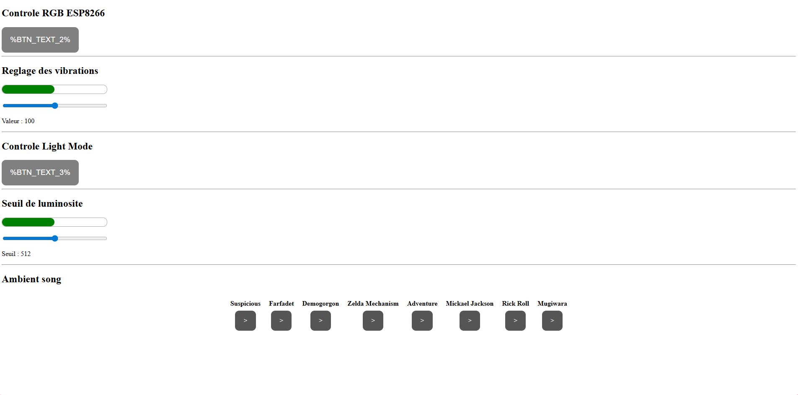

# BE Lanterne Minecraft

Ce dépôt sert de base pour développer une application embarquée propre, modulaire et facilement extensible.

---
## Aperçu du Produit

Voici quelques images de ce à quoi le projet final ressemble :


---
## Description

Ce projet fournit une structure minimale pour un programme Arduino en C++, organisée autour de classes.  
Il nécessite un fichier `passwords.h` (non fourni) contenant les identifiants réseau, par exemple pour un partage de connexion.

---

## Prérequis

Avant de commencer, assurez-vous d’avoir :

- Un environnement Arduino fonctionnel (Arduino IDE, VS Code + extension Arduino, etc.)
- Un compilateur C++ compatible Arduino
- Une carte compatible (ESP32 / ESP8266 / Arduino avec Wi-Fi selon le projet)

---
## Structure du projet
- libs/ : Contient les bibliothèques utilitaires POO
- lanterne_minecraft/ : Code source principal
- passwords.h : (À créer vous-même) Configuration des identifiants réseau
- images/ : contient les images utilisées pour le README

---
## Installation
### 1. Cloner le dépôt
Clonez le dépôt :

```bash
git clone https://github.com/Melkovich34/BE_POO_Template.git
cd BE_POO_Template
```
### 2. Configuration du Wi-Fi (Obligatoire)

Le fichier contenant les mots de passe n'est pas inclus dans le dépôt pour des raisons de sécurité. Vous devez le créer manuellement.

Créez un fichier nommé passwords.h dans le dossier src/ (ou include/ selon votre structure).

Copiez-y le code ci-dessous en remplaçant les valeurs par celles de votre partage de connexion :

```cpp
#ifndef PASSWORDS_H
#define PASSWORDS_H

// Remplacez ci-dessous par le nom exact (SSID) et le mot de passe de votre partage de connexion
const char* ssid "Nom_De_Votre_Telephone"
const char* password "Votre_Mot_De_Passe"

#endif
```

Note : Assurez-vous que votre partage de connexion est activé et visible (de préférence sur la bande 2.4GHz si vous utilisez un ESP32/ESP8266).

---

## Compilation et Téléversement
Avec Arduino IDE
- Ouvrez le fichier principal (.ino).
- Sélectionnez votre type de carte et le port COM dans Outils.
- Cliquez sur le bouton Téléverser (flèche vers la droite).

---
## Utilisation et Interaction
Une fois le programme téléversé :
1. Ouvrir le Moniteur Série :
    Outils > Moniteur Série (ou Ctrl+Shift+M).

2. Configurer la vitesse (Baud Rate) :
Réglez la vitesse sur 115200 baud.

3. Interaction :
    - Le programme affichera l'état de la connexion Wi-Fi.
    - Une fois connecté, l'adresse IP attribuée s'affichera.
    - Vous pouvez envoyer des commandes via la barre de saisie pour interagir avec le programme.

Conseil : Pour que le son fonctionne correctement, il faut débrancher et rebrancher la carte.

---

## Interface Web 

Le projet intègre un serveur web embarqué permettant de piloter le système à distance depuis n'importe quel navigateur (ordinateur ou smartphone) connecté au même réseau.

### 1. Accès
Une fois l'ESP connecté au Wi-Fi, ouvrez votre navigateur et entrez l'**adresse IP** qui s'est affichée dans le Moniteur Série (ex: `http://192.168.1.XX`).

### 2. Fonctionnalités



L'interface se divise en 4 zones principales :

1.  **Contrôle RGB & Modes :** 
    - Les boutons (affichant `%BTN_TEXT%` sur l'aperçu) indiquent l'état actuel et permettent d'activer/désactiver les LEDs ou de changer le mode d'éclairage ("Light Mode") en mode manuel ou mode Auto (utilisation du détecteur de luminosité).

2.  **Réglage des Vibrations :**
    - Un curseur (slider) permet d'ajuster finement l'intensité du moteur de vibration (de 0 à 100).

3.  **Seuil de Luminosité :**
    - Ce réglage définit la sensibilité du capteur de lumière. Si la luminosité ambiante passe sous ce seuil (valeur affichée), le système peut réagir automatiquement (ex: allumer les LEDs).

4.  **Ambient Song (Lecteur Musical) :**
    - Une série de boutons pour déclencher des mélodies prédéfinies via le buzzer (ex: *Zelda, Rick Roll, Demogorgon*, etc.).